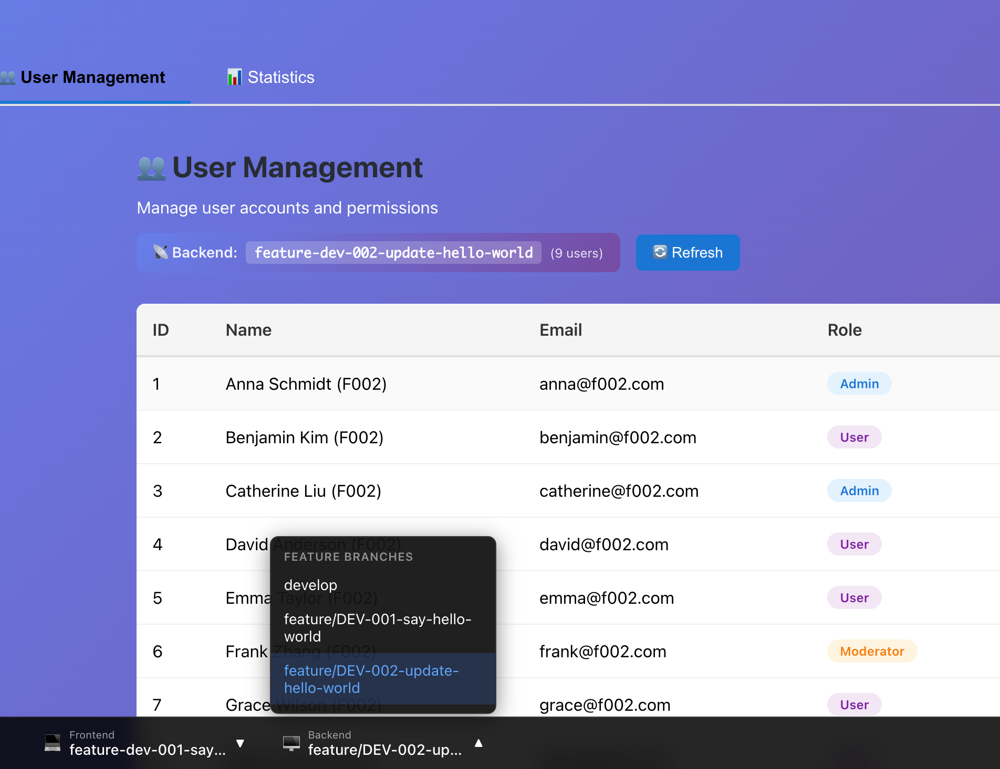
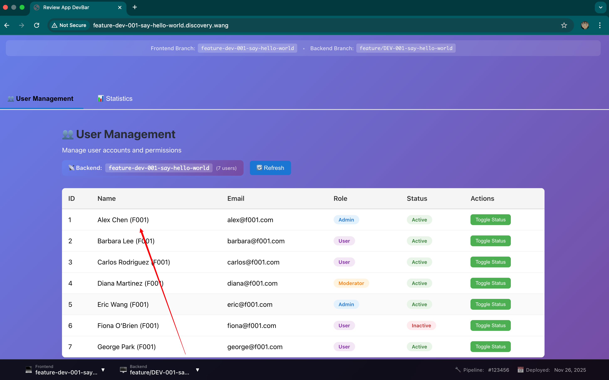
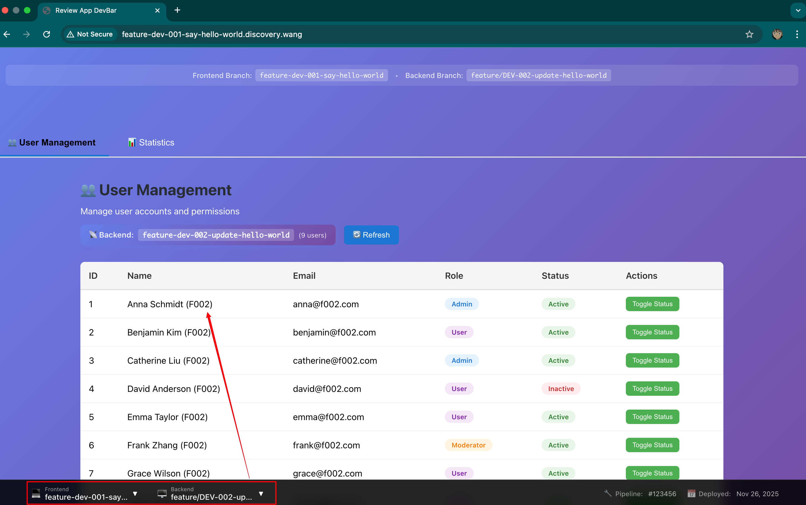

# Review App DevBar 🚀

一个固定在浏览器底部的环境切换工具栏，允许开发者和 QA 动态切换前端资源和后端 API 版本。


## 💡 核心功能

- ✅ 动态切换前后端分支环境
- ✅ 基于 Cookie + Nginx 路由
- ✅ 从 GitLab API 自动发现已部署的分支
- ✅ React 组件，可单独使用，也可集成到任何前端项目
- ✅ 完整的前后端 API 集成示例（用户管理和统计面板）

## 📋 先决条件
在开始使用 Review App DevBar 之前，请确保你已经准备好以下内容：

- **Node.js** (v16+) 和 **npm** - 用于前端开发和构建
- **Docker** 和 **Docker Compose** - 用于本地 Demo 演示
- **GitLab Access Token** - 需要 `read_repository` 权限，用于自动发现已部署的分支
- **GitLab Project IDs** - 前端和后端项目的 Project ID


## 🚀 快速开始
### Snapshot




### 本地快速体验

如果你想快速体验 DevBar 的功能，可以按照以下步骤在本地运行：

#### 1. 配置 host 域名

编辑 `/etc/hosts` 文件，添加以下域名映射：

```bash
sudo nano /etc/hosts
```

添加以下内容：

```
# DevBar 本地开发环境
127.0.0.1  develop.discovery.wang
127.0.0.1  develop.api.discovery.wang
127.0.0.1  feature-dev-001-say-hello-world.discovery.wang
127.0.0.1  feature-dev-001-say-hello-world.api.discovery.wang
127.0.0.1  feature-dev-002-update-hello-world.discovery.wang
127.0.0.1  feature-dev-002-update-hello-world.api.discovery.wang
127.0.0.1  discovery.wang
```

#### 2. 配置环境变量

创建 `.env` 文件并填入 GitLab 配置：

```bash
# 创建 .env 文件
cp .env.example .env
```
> 💡 如何获取 GitLab Token 和 Project ID？请参考 [配置](#-配置) 部分。

#### 3. 一键启动

使用 Makefile 快速启动（会自动检查 hosts、安装依赖、构建并启动服务）：

```bash
make quick-start
```

或者分步执行：

```bash
# 安装依赖
make install

# 构建并启动服务
make dev
```

#### 4. 访问默认分支

打开浏览器访问：

```
http://develop.discovery.wang
```

你将看到 DevBar 工具栏固定在页面底部，可以自由切换前后端分支环境。

### 集成到你的前端项目（推荐）

#### 1. 复制 DevBar 组件

```bash
# 克隆本仓库
git clone <repository-url>
cd review-app-devbar

# 复制组件到你的项目
cp -r src/components/DevBar <your-project>/src/components/
cp public/dev-ops/environments.php <your-project>/public/dev-ops/
```

#### 2. 在项目中使用

```tsx
// App.tsx
import { DevBar } from './components/DevBar';

function App() {
  return (
    <>
      <YourAppContent />
      <DevBar />  {/* 添加 DevBar */}
    </>
  );
}
```

#### 3. 配置 GitLab Token

编辑 `public/dev-ops/environments.php`：

```php
$gitlabToken = 'your_gitlab_token_here';
$frontendProjectId = 'your_frontend_project_id';
$backendProjectId = 'your_backend_project_id';
```

#### 4. 配置 Nginx

参考 `nginx/review-app.conf`

完成！🎉

## 🔧 配置

### GitLab Access Token

1. 登录 GitLab → **Settings > Access Tokens**
2. 创建 Personal Access Token
3. 勾选 `read_repository` scope
4. 复制 Token 到配置文件

### 获取 Project ID

进入 GitLab 项目页面，在项目首页查看 **Project ID**。

## 📚 详细文档

- **[架构设计](./ARCHITECTURE.md)** - Cookie 路由原理、Nginx 配置详解、双域名系统
- **[生命周期](./LIFECYCLE.md)** - 完整的请求流程、分支切换流程、组件交互

## 🔍 故障排查

### 分支列表为空

```bash
# 测试 API
curl https://your-domain/dev-ops/environments.php
```

检查：
- GitLab Token 权限
- Project ID 是否正确

### 切换前端分支无效

检查：
- Cookie `x_target_frontend` 是否设置（浏览器开发者工具 > Application > Cookies）
- 前端项目的 Nginx 是否配置了 Cookie 路由
- 目标分支是否已部署：`curl https://<branch>.discovery.wang`

### 切换后端分支无效

检查：
- Cookie `x_target_backend` 是否设置
- 项目是否使用了 DevBar 的 `apiClient.ts`
- 目标后端是否已部署：`curl https://<branch>.api.discovery.wang/health`

## 📄 许可证

MIT License

---

Made with ❤️ by DevOps Team
